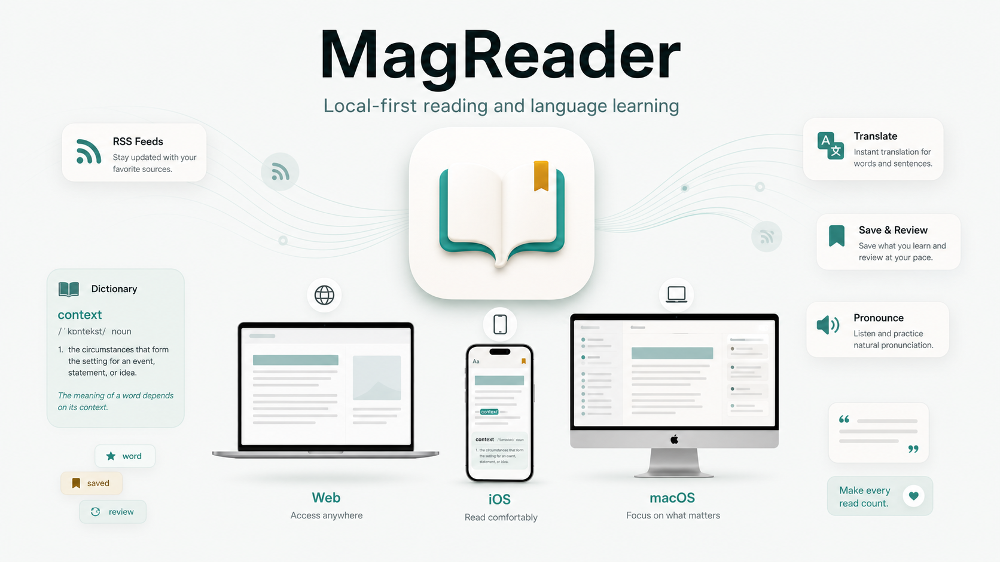

# MagReader

> Local-first reading and language-learning apps for people who read English articles deeply.


MagReader combines RSS reading, focused article typography, word/sentence translation, dictionary meanings, saved notes, pronunciation, review, and export. The project is packaged as independent platform apps so each version can be built and used on its own.

## Poster



## Platform Apps

| Platform | App Directory | Guide | Notes |
| --- | --- | --- | --- |
| Web | [`web/`](web/) | [`web/README.md`](web/README.md) | Next.js app with local SQLite and Web export support. |
| iOS | [`ios/`](ios/) | [`ios/README.md`](ios/README.md) | Native SwiftUI app built with Xcode. |
| macOS | [`macos/`](macos/) | [`macos/README.md`](macos/README.md) | Native SwiftUI desktop app built with Xcode. |

The Web, iOS, and macOS apps do not share a runtime or database. They are local-first and can fetch RSS, translation, and dictionary data directly from online services.

## What MagReader Does

- Manages RSS/Atom feeds and archives stale feed items.
- Groups articles by feed with collapsible sections.
- Renders readable article content with comfortable typography.
- Highlights words and sentences with a two-step selection flow.
- Translates quickly first, then loads dictionary meanings only when requested.
- Saves words, sentences, source context, dictionary meanings, and review state locally.
- Supports explicit Speak actions and review workflows.
- Exports saved learning items as CSV or JSON on platforms with export UI.

## Project Layout

```text
.
├── web/                  # Web app, Web README, npm package, tests
├── ios/                  # iOS Xcode project, iOS README, SwiftUI app
├── macos/                # macOS Xcode project, macOS README, SwiftUI app
├── shared/MagReaderCore/ # Shared Apple business logic and tests
├── docs/                 # Architecture, platform notes, poster
├── .github/              # CI and contribution templates
├── CONTRIBUTING.md
├── SECURITY.md
├── CHANGELOG.md
└── LICENSE
```

## Documentation

- [Architecture](docs/architecture.md)
- [Platform notes](docs/platforms.md)
- [Development guide](docs/development.md)
- [Web/iOS/macOS feature comparison](docs/ios-web-feature-comparison.md)

## Contributing

Contributions are welcome. Start with [CONTRIBUTING.md](CONTRIBUTING.md), and keep platform-specific changes inside the relevant app directory unless the change is project-level documentation or CI.

## License

MIT. See [LICENSE](LICENSE).
